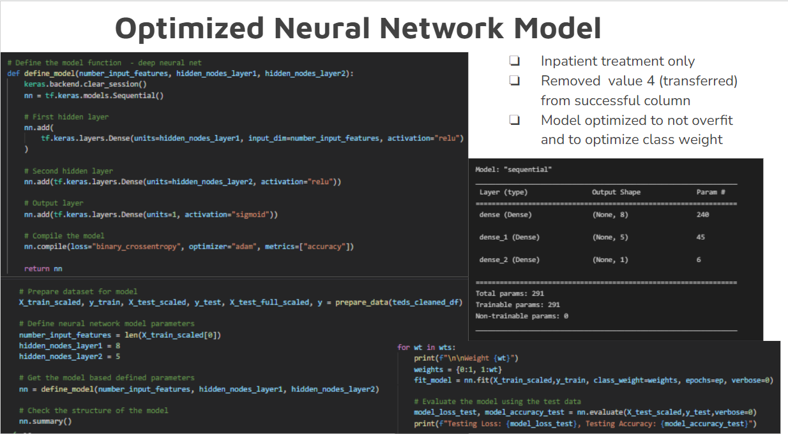
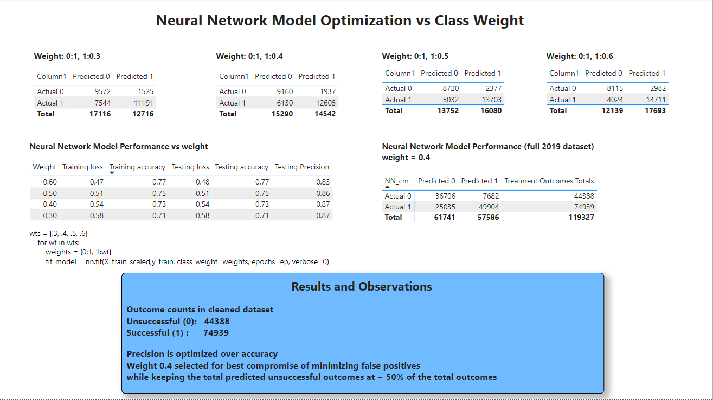

# TEDS Analysis

## Project Outline
Primary project goal is to develop a machine learning model that predicts successful treatment outcomes based on publicly available data from treatment centers around the US. This data is prepared by Substance Abuse and Mental Health Services Administation (SAMHSA) and called Treatment Episode Dataset Discharges (TEDS-D2019). This dataset contains all the intake admission data as well as the treatment outcome at discharge.  The target is for the model to use the intake admission data and then to successfully predict the treatment outcomes.   
Primary questions to answer: 
1) What are the factors contributing to success rates in the treatment program?
2) Can patients at risk of not completing treatment be identified at admission based on the standard data collected at time of admission? 
3) Where are areas that could use special attention or improvement?

Successfully answering question 2 would allow treatment centers to focus more resources on patients identified as "higher risk" of not completing treatment in the hope of improving overall successful treatment completion rate.
## Summary of Results
- A successful completion of treatment is assumed to be a good indicator of a solid foundation to a successful recovery process
- The model optimization focused on precision vs overall accuracy in order to capture the most patients that were unsuccessful in completing treatment. Precision could be increased addtionally to decrease false postives (patients predicted to be successful but were actually unsuccessful) but at the expense of increasing the number of false negatives (patients predicted to be unsuccessful but were actually successful).
- The Model was successfully optimized using data collected at admission to capture the most patients that were unsuccessful at completing treatment while keeping in mind constrained resources.  
- The result allows these patients to be identified at admission and to be targeted for more focused treatment such as more therapy sessions.
- Additional analysis is needed to further study the key feature contributors to a successful outcome so that more specific recommendations on additional focused attention that would benefit the identified higher risk patients.
- Further analysis is planned to incorporate previous multi-year data to train the model and evaluate the model on current year’s data.

## Resources
- [Dataset link](https://www.datafiles.samhsa.gov/dataset/teds-d-2019-ds0001-teds-d-2019-ds0001)
- add other years links

- [Codebook link](https://github.com/loudonadam/TEDS_Analysis/blob/scott/Resources/TEDS-D-2019-DS0001-info-codebook_V1.docx)

- Software: Jupyter Notebook 6.4.6, Python 3.7.11, tensorflow 2.7.0, scikit-learn 1.0, pandas 1.3.4, Tableau
## Team Members
Adam Loudon, Scott Yoder, Colin Donavan, Kitt Franse

## Tools and Workflow
Python and pandas is used to wrangle, clean, and organize the data. Further, scikitlearn and tensorflow are used to generate machine learning models to predict successful treatment outcomes. TEDS_data_cleaning.ipynb is run to clean and preprocess the datasets for use by the machine learning code.  The cleaned dataframes for each year (using TEDS_data_cleaning.ipynb) are optionally exported to a .csv file or to a SQL database for storage.  The machine learning model code (TEDS_ml_model_multi_year.ipynb) reads the cleaned data from a .csv or from the SQL database.  The model results are optionally exported to a .csv file or to the SQL database.  Finally, Tableau is used to create impactful and understandable presentations of the data.  

## Analysis Results
### Data Cleaning
- The dataset availabe from SAMHSA contains numeric only data and a codebook is available that defines the numeric codes which greatly simplifies the pre-processing / data cleaning required for the machine learning models.  See example below.   

- This feature like the others has a value of -9 for all missing/unknown/not collected/invalid data.  This value is used to remove all the data in the dataset that is missing.  As in example of cleaning process, we combine the race values 1,3,6,9 that are less than 1% to a new value of 10. Keep values 2, 4, 5, 7, 8 as is. The image below shows the additonal cleaning of the feature columns as well as the creation of the target column SUCCESSFUL. The TED variables were selected based on an initial review of the codebook and then iterated to improve the accuracy of the predication model. 

[Image link for data cleaning](Resources/Images/Data_Cleaning.png)

- The SERVICES column is filterd on values 4 and 5 to focus on inpatient treatment only.

[Image link for services column](Resources/Images/SERVICES_feature.png)

- The TARGET column "SUCCESSFUL" is created based on the REASONS column. A SUCCESSFUL value of 1 (Treatment completed) represnts a SUCCESSFUL treatment outcome.  Values 4(Transferred),5(incarcerated),6(Death),7(other) are removed and the other values are changed to 0 to represent a NON SUCCESSFUL treatment outcom. 

- Successfully implementd exporting Dataframe with cleaned data to SQL database.

[Image Link for SQL database](Resources/Images/cleaned_data_TEDS_DB.png)

# 

### Initial Random Forest Classifier and Nueral Network Models
- Initial models focused on outpatient treatment only since this provided the most data and removed in patient data from the dataset.  
- It was determined the models were overfitting and the classes were very unbalanced ~ 100:1 unsuccessful to succesful outcomes.  The results also yielded a large number of false negatives.  The results didn't help answer the questions proposed and provided nothing actionable.
- The feature list from the Random Forest Classifier provided some focus on parameters to analysis  

- Successfull implemented exported model feature importances to SQL database.
    - [Image link for SQL database results](/Resources/Images/RFModel_feature_importance_TEDS_DB.png)

- Inital NN model links
    - [Image Link for inital model creation](Resources/Images/NN_model.png)
    - [Image Link for inital model results](Resources/Images/NN_model_result_1.png)

#

### Optimzed Neural Network Model

- NN model creation

- NN model performance

## Presentation
This project's results are best described this this [presentation](https://public.tableau.com/app/profile/adam.loudon/viz/TEDS_Analysis-Dashboard/Presentation?publish=yes).

## Project Challenges
Some potential issues:
-   Some of the important data in our dataset have significant amounts of missing datapoints.  This issue was made easier to deal with based on the fact that all the feature columns use the value -9 to represent missing data.  All values with -9 are removed from the dataset features selected.  There were a number of feature columns that were not used based on the large amount of missing data as noted in the codebook.  
-   There are a tremendous number of features available in our data. Determining which we want to use is going to be a significant task. Much of this information is stored in a PDF, so may need to be manually converted to usable codes/information.  Determining and managing the number features used in the model will be an ongoing process to achieve the most optimal model performance.  After reviewing the codebook in more detail the information stored in PDF is not a major issue.  The actual dataset contains only numerical values that are defined in the PDF codebook.  Reviewing the codebook is time consuming and will be an ongoing part of the analysis to get the final feature selection / reduction.  
-   As a team, we are still new to using GitHub as a collaborative tool. Hopefully we will be able to navigate this relatively new technology effectively. 
- Intitially focused on outpatient only very unbalance class with many unsuccessful values, model was overfitting, no actionable outcome from the model results

## Next steps
