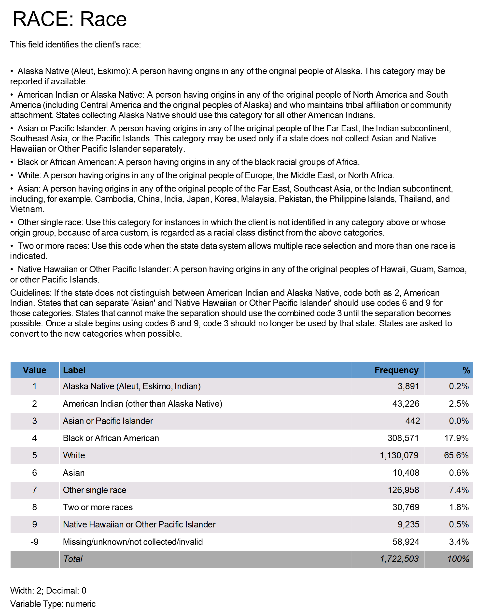
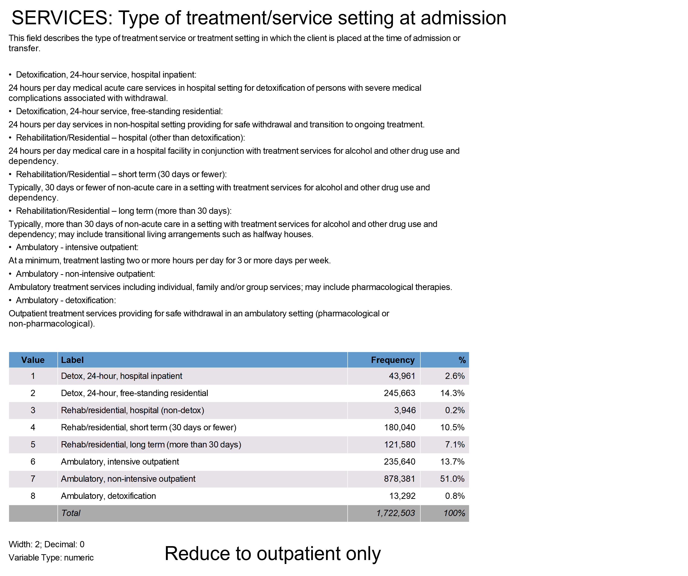
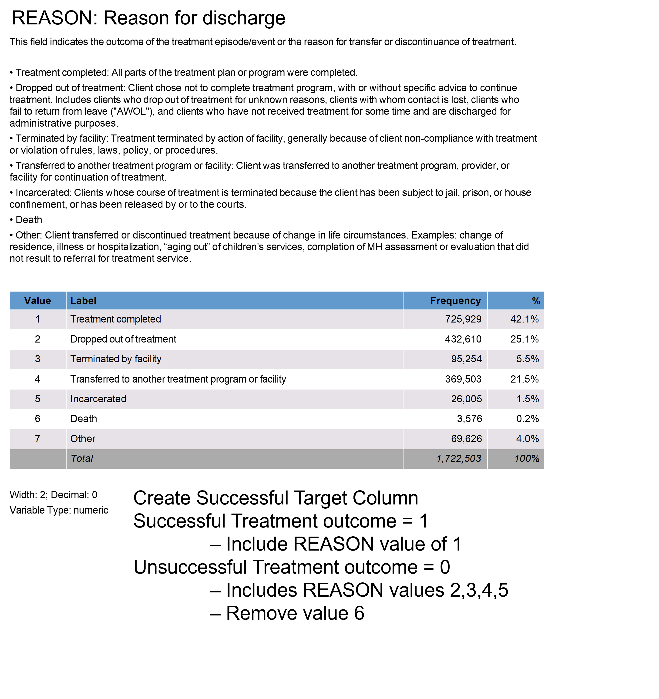
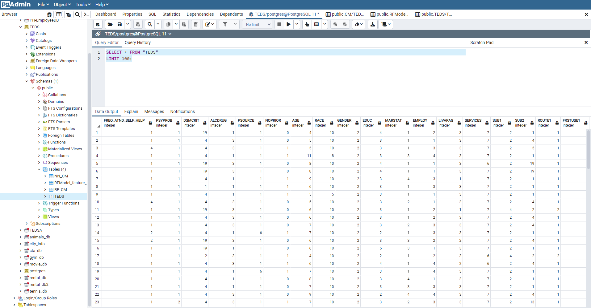
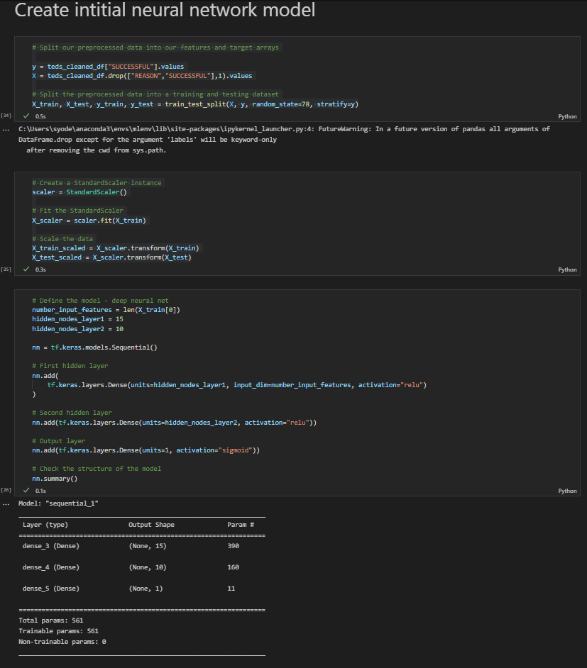
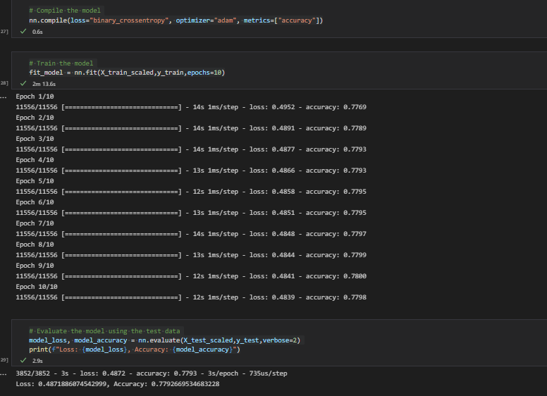
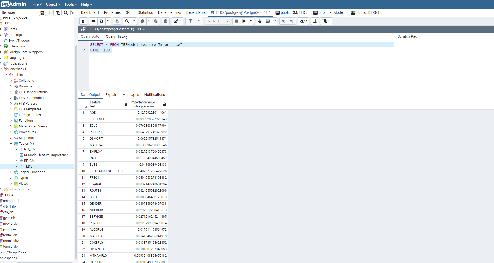

# TEDS Analysis

## Project Outline
Using publicly available data from treatment centers around the US. This data is prepared by Substance Abuse and Mental Health Services Administation (SAMHSA) and called Treatment Episode Dataset Discharges (TEDS-D2019). 

We will use this data in order to determine which factors best predict patient outcomes. If we can understand which factors (i.e. marital status, race, drug type, etc), we may be able to predict which patients would benefit most from additional attention.  

## Resources
[Dataset link](https://www.datafiles.samhsa.gov/dataset/teds-d-2019-ds0001-teds-d-2019-ds0001)

[Codebook link](https://github.com/loudonadam/TEDS_Analysis/blob/scott/Resources/TEDS-D-2019-DS0001-info-codebook_V1.docx)

## Team Members
Adam Loudon, Scott Yoder, Colin Donavan, Kitt Franse

## Tools and Workflow
Python and pandas is used to wrangle, clean, and organize the data. Further, scikitlearn and tensorflow are used to generate machine learning models to predict successful treatment outcomes. Additionally the team hopes to generate an analysis using R as well.  The cleaned dataframe (using TEDS_data_cleaning.ipynb) is optionally exported to a .csv file or to a SQL database for storage.  The machine learning model code (TEDS_ml_model.ipynb) optionally reads the cleaned data from a .csv or from the SQL database.  The model results are optionally exported to a .csv file or to the SQL database.  Finally, Tableau is used to create impactful and understandable presentations of the data.  

## Initial Analysis Results
### Data Cleaning
The dataset availabe from SAMHSA contains numeric only data and a codebook is available that defines the numeric codes which greatly simplifies the pre-processing / data cleaning required for the machine learning models.  See example below.   

This feature like the others has a value of -9 for all missing/unknown/not collected/invalid data.  This value is used to remove all the data in the dataset that is missing.  As in example of cleaning process the RACE feature with any values < 1% were removed which includes values 1,3,6,9, as well as the missing/unknown value of -9.  The image below shows the additonal cleaning of the feature columns as well as the creation of the target column SUCCESSFUL. The TED variables were selected based on an initial review of the codebook and then iterated to improve the accuracy of the predication model. 

The SERVICES column is filterd on values 6 and 7 which focus on outpatient treatment only.

The TARGET column "SUCCESSFUL" is created based on the REASONS column. A SUCCESSFUL value of 1 (Treatment completed) represnts a SUCCESSFUL treatment outcome.  Values 6 (DEATH) is removed and the other values are changed to 0 to represent a NON SUCCESSFUL treatment outcom. 

Dataframe with cleaned data exported to SQL database.

### Initial Neural Network Model

- NN model creation

- NN model performance

### Initial Random Forest Classifier Model

- RF model performance

- RF model feature importances

Export model feature importances to SQL database.

## Drafts of Presentation
Presentation drafts now include this Google Slides [document](https://docs.google.com/presentation/d/1xxn2C3Z-MkE-vdw5f6fMtGrpJwCFIwu-_7JIMBB3tTE/edit?usp=sharing) and this Tableau [story](https://public.tableau.com/app/profile/adam.loudon/viz/TEDS_Analysis-Dashboard/Presentation) which will be merged into a single presentation.

## Potential Challenges
Some potential issues:
-   Some of the important data in our dataset have significant amounts of missing datapoints.  This issue was made easier to deal with based on the fact that all the feature columns use the value -9 to represent missing data.  All values with -9 are removed from the dataset features selected.  There were a number of feature columns that were not used based on the large amount of missing data as noted in the codebook.  
-   There are a tremendous number of features available in our data. Determining which we want to use is going to be a significant task. Much of this information is stored in a PDF, so may need to be manually converted to usable codes/information.  Determining and managing the number features used in the model will be an ongoing process to achieve the most optimal model performance.  After reviewing the codebook in more detail the information stored in PDF is not a major issue.  The actual dataset contains only numerical values that are defined in the PDF codebook.  Reviewing the codebook is time consuming and will be an ongoing part of the analysis to get the final feature selection / reduction.  
-   As a team, we are still new to using GitHub as a collaborative tool. Hopefully we will be able to navigate this relatively new technology effectively. 
