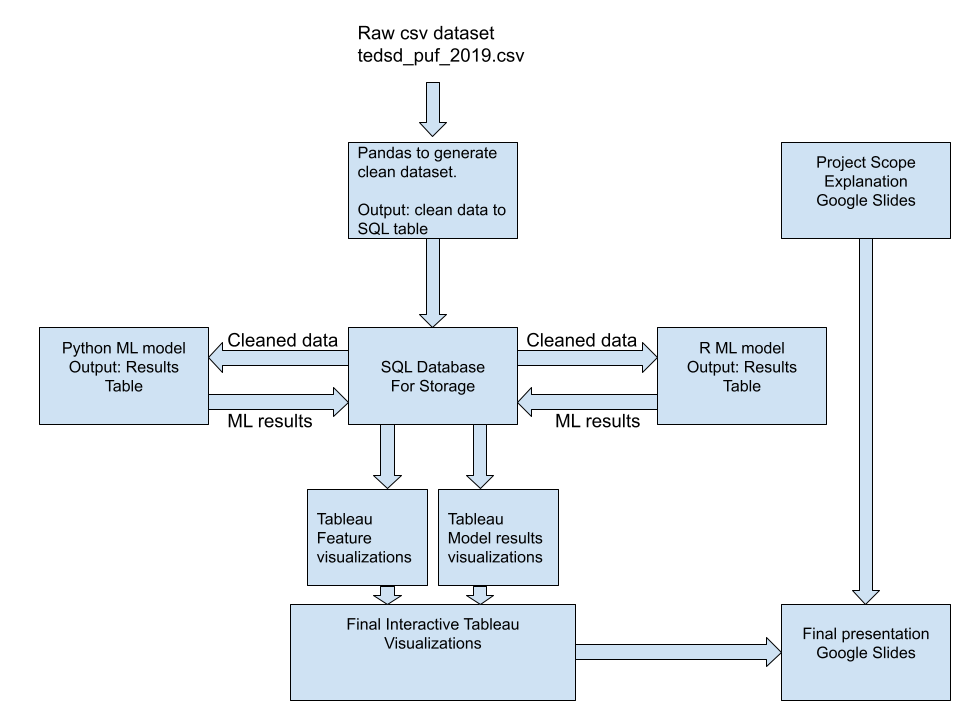
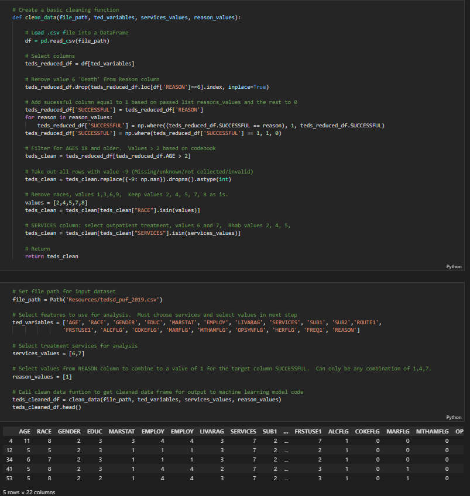
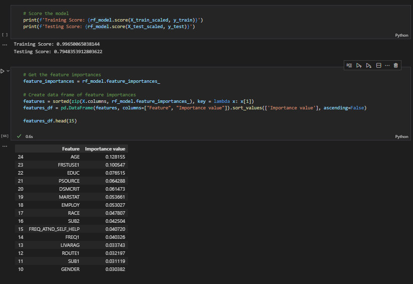
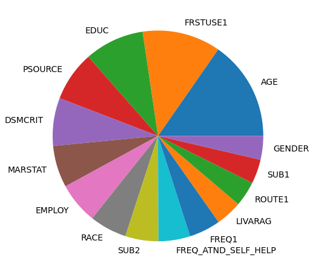

# TEDS Analysis

## Project Outline
Using publicly available data from treatment centers around the US. This data is prepared by Substance Abuse and Mental Health Services Administation (SAMHSA) and called Treatment Episode Dataset Discharges (TEDS-D2019). 

We will use this data in order to determine which factors best predict patient outcomes. If we can understand which factors (i.e. marital status, race, drug type, etc), we may be able to predict which patients would benefit most from additional attention.

## Resources
[Dataset link](https://www.datafiles.samhsa.gov/dataset/teds-d-2019-ds0001-teds-d-2019-ds0001)

## Team Members
Adam Loudon, Scott Yoder, Colin Donavan, Kitt Franse

## Tools
We intend to use python and pandas to wrangle, clean, and organize the data. Further, we will use scikitlearn and potentially tensorflow to cluster our data into meaningful categories. Finally, we will use Tableau to create impactful and understandable presentations of the data.

## Results
### Data Cleaning

### Initial Random Forest Classifier Model results

### Feature Importance

## Potential Challenges
Some potential issues:
-   Some of the important data in our dataset have significant amounts of missing datapoint.
-   There are a tremendous number of features available in our data. Determining which we want to use is going to be a significant task. Much of this information is stored in a PDF, so may need to be manually converted to usable codes/information.
-   As a team, we are still new to using GitHub as a collaborative tool. Hopefully we will be able to navigate this relatively new technology effectively. 
